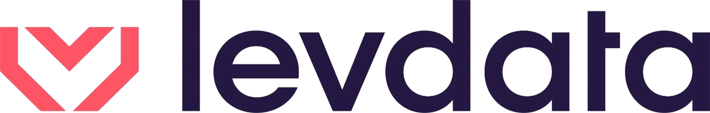

# Fluxo de Caixa — Teste Técnico Frontend

Bem-vindo(a)! Este projeto é a base para o teste técnico de frontend. Ele contém **apenas** a tela de **Fluxo de Caixa**, extraída de um portal maior, já com o padrão visual e a estrutura de pastas usados no frontend da empresa.

<p align="center">
  
</p>

## O que você vai encontrar aqui

- Uma tela única (`Fluxo de Caixa`) 100% funcional no frontend, com cards de resumo, gráfico de linha, tabelas de entradas/saídas, alertas e ações rápidas.
- Um cabeçalho simplificado (logo + avatar/usuário), sem menu lateral e sem dropdown — este teste libera acesso a uma única empresa, então esses elementos de navegação não são necessários.
- **Nenhuma dependência de backend, autenticação ou infraestrutura.** Tudo que existia de login (AWS Cognito/Amplify), variáveis de ambiente com chaves/segredos e chamadas de API real foi removido. Os dados exibidos hoje são **mockados/estáticos**, direto no componente.

## O que é esperado do candidato

O objetivo do teste é você **construir a API e a conexão com banco de dados do zero** e trazer os dados reais para esta tela, substituindo os valores mockados em [`src/project/dashboards-levdata/CashFlow/index.js`](./src/project/dashboards-levdata/CashFlow/index.js).

Fique à vontade para:

- Criar a camada de chamadas HTTP (services/api) que preferir.
- Adicionar gerenciamento de estado (Context, Redux, React Query, etc.) se achar necessário.
- Ajustar a modelagem dos dados conforme a API/banco que você construir.

> Mantenha o padrão visual e a organização de pastas já existentes (`src/components`, `src/project`, `styledComponentsStyles.js`, `theme`) sempre que possível — isso é parte do que estamos avaliando.

## 🎁 Bônus

Como diferencial, deixe a tela **responsiva** para diferentes tamanhos de tela (desktop, tablet e mobile). Hoje o layout foi pensado para desktop; adaptar os cards, o gráfico e as tabelas para telas menores conta pontos extras.

## Stack utilizada

| Camada | Tecnologia |
| --- | --- |
| Framework | React 18 (Create React App / `react-scripts`) |
| UI | Material UI (MUI v5) |
| Estilização | styled-components + tema próprio (`src/theme`, `src/styledThemeOn`) |
| Gráficos | `@nivo/line` |
| Rotas | React Router v6 |

## Pré-requisitos

- [Node.js](https://nodejs.org/) 18 ou superior
- npm 9 ou superior (vem junto com o Node)

## Como rodar o projeto

```bash
# 1. Instale as dependências
npm install

# 2. Suba o servidor de desenvolvimento
npm start
```

A aplicação abrirá automaticamente em [http://localhost:3000](http://localhost:3000). Qualquer alteração salva no código recarrega a página automaticamente.

### Outros scripts disponíveis

| Comando | O que faz |
| --- | --- |
| `npm start` | Roda o app em modo desenvolvimento |
| `npm run build` | Gera o build de produção na pasta `build/` |
| `npm run lint` | Roda o ESLint no código-fonte |
| `npm run format` | Formata o código-fonte com o Prettier |

## Estrutura de pastas

```
src/
├── assets/                          # imagens/logos usados na tela
├── components/
│   ├── ErrorBoundary/                # captura erros de renderização
│   ├── Layout/
│   │   ├── Navbar/                   # cabeçalho (logo + avatar/nome)
│   │   ├── StandardLayout/           # layout padrão das páginas
│   │   └── Footer/
│   ├── MTWActions/                   # botões reutilizáveis (voltar, navegação)
│   └── ProductHeader/                # cabeçalho de página (título, breadcrumb)
├── project/
│   └── dashboards-levdata/
│       └── CashFlow/                 # 👉 a tela de Fluxo de Caixa (ponto de partida)
├── styledComponentsStyles.js         # estilos compartilhados (styled-components)
├── styledThemeOn/                    # tema usado pelo styled-components
├── theme/                            # tema usado pelo MUI
├── App.js                            # rotas da aplicação
└── index.js                          # ponto de entrada
```

Boa sorte no teste! 🚀
