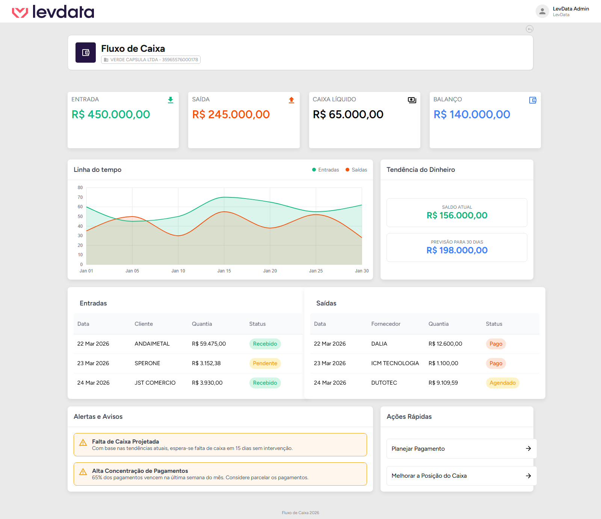

# Fluxo de Caixa — Teste Técnico

<p align="center">
  
</p>

## 📋 Sobre o teste

Este repositório contém a tela de **Fluxo de Caixa** acima, já implementada com toda a interface: cards de resumo, gráfico de linha, tabelas de entradas e saídas, alertas e ações rápidas. Os dados exibidos hoje são estáticos, prontos para serem substituídos por dados reais.

## 🎯 O que você vai construir

Implemente a API e a conexão com um banco de dados, trazendo dados reais para o lugar dos dados estáticos em [`src/project/dashboards-levdata/CashFlow/index.js`](./src/project/dashboards-levdata/CashFlow/index.js).

Você tem liberdade para:

- Definir a modelagem dos dados e o banco de dados que preferir;
- Criar a camada de chamadas HTTP (services/api) do jeito que achar melhor;
- Adicionar gerenciamento de estado (Context, Redux, React Query, etc.), se achar necessário.

> Procure manter a organização de pastas e o padrão visual já utilizados no projeto (`src/components`, `src/project`, `styledComponentsStyles.js`, `theme`) — isso também faz parte da avaliação.

## 🎁 Bônus

Deixe a tela **responsiva** para diferentes tamanhos de tela (desktop, tablet e mobile). O layout atual foi pensado para desktop; adaptar os cards, o gráfico e as tabelas para telas menores conta pontos extras.

## 🧰 Stack

| Camada | Tecnologia |
| --- | --- |
| Framework | React 18 (Create React App) |
| UI | Material UI (MUI v5) |
| Estilização | styled-components + tema próprio (`src/theme`, `src/styledThemeOn`) |
| Gráficos | `@nivo/line` |
| Rotas | React Router v6 |

## ⚙️ Pré-requisitos

- [Node.js](https://nodejs.org/) 18 ou superior
- npm 9 ou superior (vem junto com o Node)

## ▶️ Como rodar

```bash
# 1. Instale as dependências
npm install

# 2. Suba o servidor de desenvolvimento
npm start
```

A aplicação abre em [http://localhost:3000](http://localhost:3000). Alterações salvas no código recarregam a página automaticamente.

## 📜 Scripts disponíveis

| Comando | O que faz |
| --- | --- |
| `npm start` | Roda o app em modo desenvolvimento |
| `npm run build` | Gera o build de produção na pasta `build/` |
| `npm run lint` | Roda o ESLint no código-fonte |
| `npm run format` | Formata o código-fonte com o Prettier |

## 📁 Estrutura de pastas

```
src/
├── assets/                          # imagens/logos usados na tela
├── components/
│   ├── ErrorBoundary/                # captura erros de renderização
│   ├── Layout/
│   │   ├── Navbar/                   # cabeçalho
│   │   ├── StandardLayout/           # layout padrão das páginas
│   │   └── Footer/
│   ├── MTWActions/                   # botões reutilizáveis (voltar, navegação)
│   └── ProductHeader/                # cabeçalho de página (título, breadcrumb)
├── project/
│   └── dashboards-levdata/
│       └── CashFlow/                 # tela de Fluxo de Caixa
├── styledComponentsStyles.js         # estilos compartilhados (styled-components)
├── styledThemeOn/                    # tema usado pelo styled-components
├── theme/                            # tema usado pelo MUI
├── App.js                            # rotas da aplicação
└── index.js                          # ponto de entrada
```

Boa sorte! 🚀
